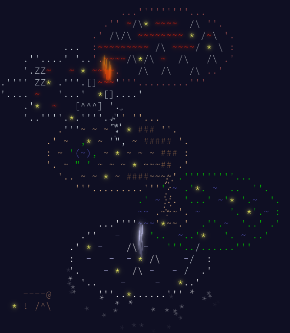

# Colourful Advent of Code 2023

Performing each day of Advent of Code day in a different language

## Languages

| Day | Language    | Link                   |
| :-: | ----------- | ---------------------- |
|  1  | Rust        | [`./day-01/`](/day-01) |
|  2  | Typescript  | [`./day-02/`](/day-02) |
|  3  | Javascript  | [`./day-03/`](/day-03) |
|  4  | Kotlin      | [`./day-04/`](/day-04) |
|  5  | Scala       | [`./day-05/`](/day-05) |
|  6  | Golang      | [`./day-06/`](/day-06) |
|  7  | Perl        | [`./day-07/`](/day-07) |
|  8  | Swift       | [`./day-08/`](/day-08) |
|  9  | Lua         | [`./day-09/`](/day-09) |
| 10  | C#          | [`./day-10/`](/day-10) |
| 11  | Haskell     | [`./day-11/`](/day-11) |
| 12  | Dart        | [`./day-12/`](/day-12) |
| 13  | Ruby        | [`./day-13/`](/day-13) |
| 14  | C           | [`./day-14/`](/day-14) |
| 15  | F#          | [`./day-15/`](/day-15) |
| 16  | C++         | [`./day-16/`](/day-16) |
| 17  | PHP         | [`./day-17/`](/day-17) |
| 18  | Python      | [`./day-18/`](/day-18) |
| 19  | Zig         | [`./day-19/`](/day-19) |
| 20  | Java        | [`./day-20/`](/day-20) |
| 21  | Julia       | [`./day-21/`](/day-21) |
| 22  | Elixir      | [`./day-22/`](/day-22) |
| 23  | Erlang      | [`./day-23/`](/day-23) |
| 24  | Clojure     | [`./day-24/`](/day-24) |
| 25  | Rust(again) | [`./day-25/`](/day-25) |

## Small review about all languages with score

## `Rust`

Perfect, nothing to add - 5/5

## `Typescript`

Good Javascript, I like it - 5/5

## `Javascript`

Just Javascript, funny 1 + "1", just don't like it, but I don't hate it either - 3/5

## `Kotlin`

Such Java as it should be - 5/5

## `Scala`

Perfect combination OOP with FP - 5/5

## `Golang`

Just comfortable language which is not interesting - 3/5

## `Perl`

Excellent script language - 4/5

## `Swift`

As Golang, just comfortable language but not interesting - 3/5

## `C#`

Better than Java - 4/5

## `Haskell`

Beautiful but non understandable - 3/5

## `Dart`

Interesting language, writing in it for mobile apps using Flutter is probably very cool - 4/5

## `Ruby`

The most boring language i have ever seen - 2/5

## `C`

I don't want to have memory leaks, I don't want to have memory leaks, I don't want to have memory leaks - 3/5

## `F#`

Perfect combination FP with OOP - 5/5

## `C++`

Just more comfortable than C, interesting - 4/5

## `PHP`

Like Javascript, just don't like it, but I don't hate it either - 3/5

## `Python`

I had a bad opinion of him, but when I tried it, I liked it. - 4/5

## `Zig`

Mega ultra super puper C on steroids, excellent - 5/5

## `Java`

I hate pure OOP, \*\*\*\* it - 3/5

## `Julia`

Better version of python, excellent - 5/5

## `Elixir`

The coolest FP i have ever seen - 5/5

## `Erlang`

Don't use it, just run and forget about it - 1/5

## `Clojure`

((((((((((((very interesting)))))))))))) - 3/5

## `Rust`

Again? Sure, perfect^2 - 5/5

## Gratitude

I want to thank all internet resources, all language docs, all threads about AoC and LLMs for helping me to pass this challenge

