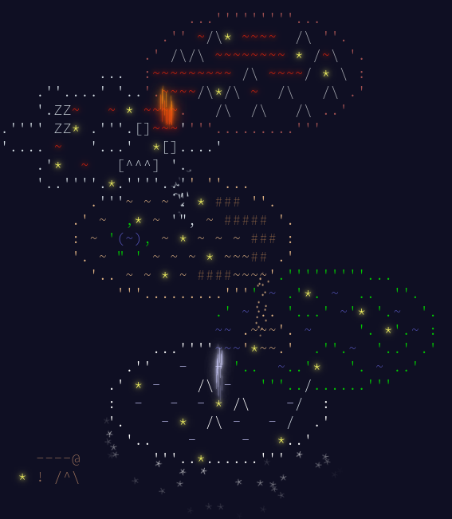

# Colourful Advent of Code 2023

Performing each day of Advent of Code day in a different language

## Languages

| Day | Language    | Link                                  |
| :-: | ----------- | ------------------------------------- |
|  1  | Rust        | [`./day-01/`](/colourful-2023/day-01) |
|  2  | Typescript  | [`./day-02/`](/colourful-2023/day-02) |
|  3  | Javascript  | [`./day-03/`](/colourful-2023/day-03) |
|  4  | Kotlin      | [`./day-04/`](/colourful-2023/day-04) |
|  5  | Scala       | [`./day-05/`](/colourful-2023/day-05) |
|  6  | Golang      | [`./day-06/`](/colourful-2023/day-06) |
|  7  | Perl        | [`./day-07/`](/colourful-2023/day-07) |
|  8  | Swift       | [`./day-08/`](/colourful-2023/day-08) |
|  9  | Lua         | [`./day-09/`](/colourful-2023/day-09) |
| 10  | C#          | [`./day-10/`](/colourful-2023/day-10) |
| 11  | Haskell     | [`./day-11/`](/colourful-2023/day-11) |
| 12  | Dart        | [`./day-12/`](/colourful-2023/day-12) |
| 13  | Ruby        | [`./day-13/`](/colourful-2023/day-13) |
| 14  | C           | [`./day-14/`](/colourful-2023/day-14) |
| 15  | F#          | [`./day-15/`](/colourful-2023/day-15) |
| 16  | C++         | [`./day-16/`](/colourful-2023/day-16) |
| 17  | PHP         | [`./day-17/`](/colourful-2023/day-17) |
| 18  | Python      | [`./day-18/`](/colourful-2023/day-18) |
| 19  | Zig         | [`./day-19/`](/colourful-2023/day-19) |
| 20  | Java        | [`./day-20/`](/colourful-2023/day-20) |
| 21  | Julia       | [`./day-21/`](/colourful-2023/day-21) |
| 22  | Elixir      | [`./day-22/`](/colourful-2023/day-22) |
| 23  | Erlang      | [`./day-23/`](/colourful-2023/day-23) |
| 24  | Clojure     | [`./day-24/`](/colourful-2023/day-24) |
| 25  | Rust(again) | [`./day-25/`](/colourful-2023/day-25) |

